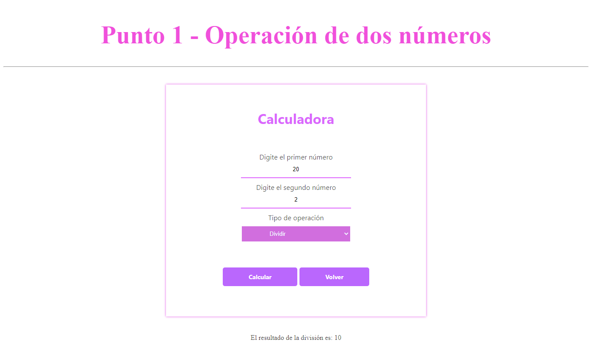
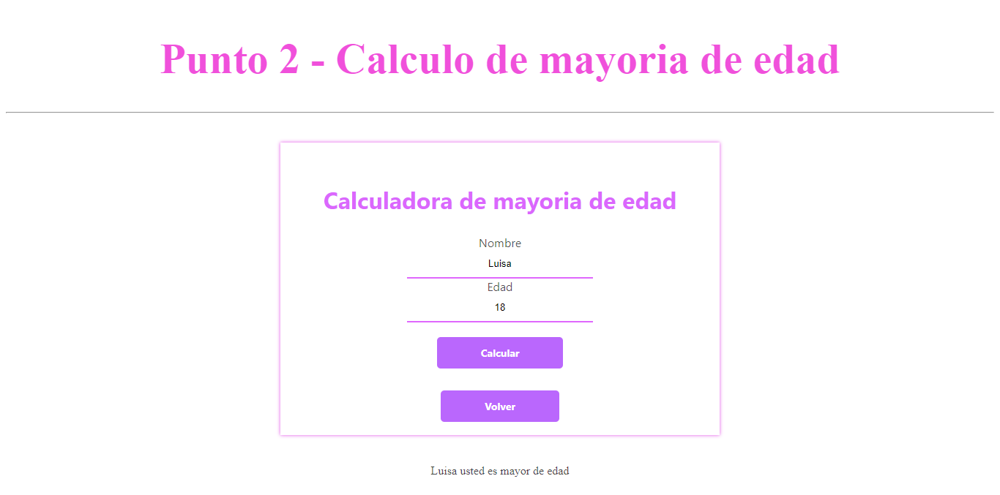
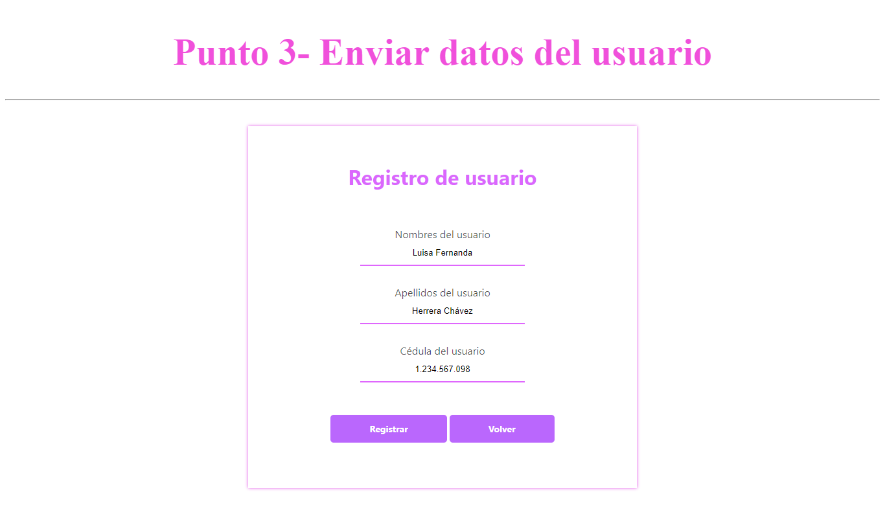
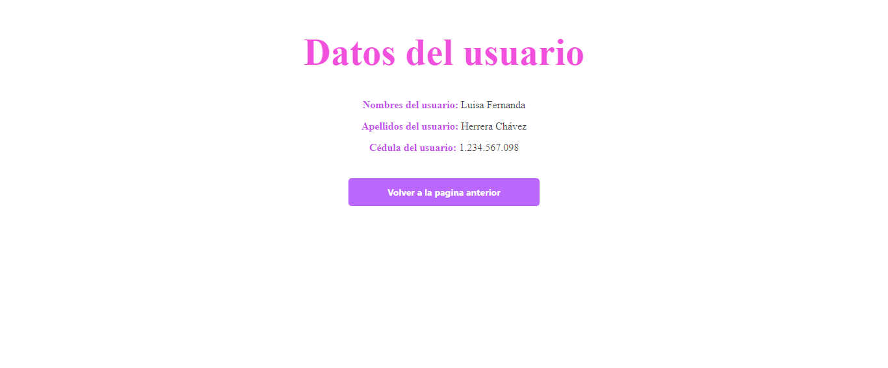
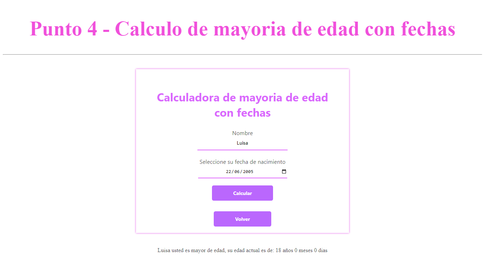
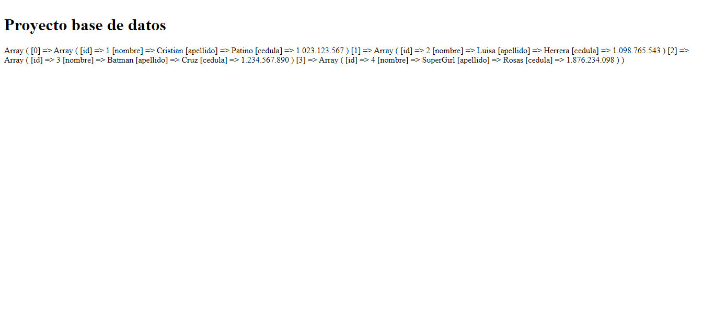
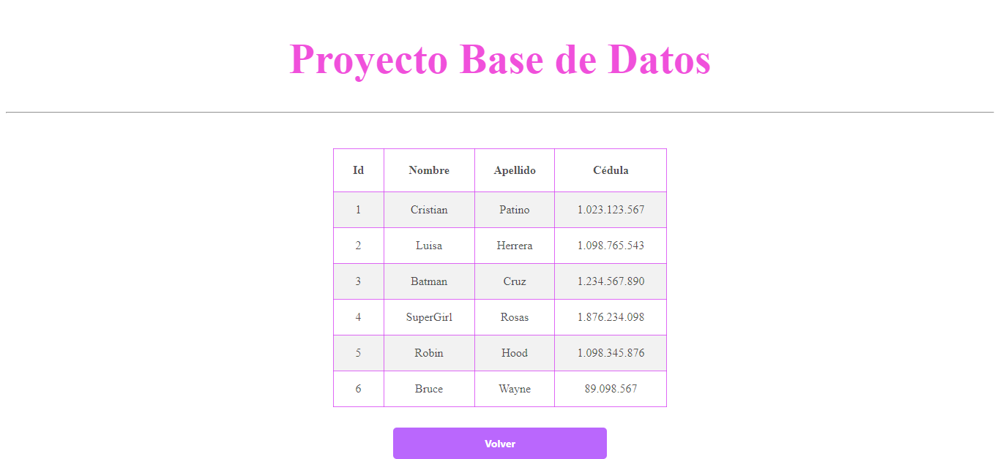

<h1>Taller 10 Luisa Fernanda Herrera Chávez </h1>

<h2> Información</h2>

Curso: full Stack Basico - Grupo 1 

Profesor: Cristian Patiño

<h2> Punto 1: Operación de dos números</h2>

<h2> Punto 2: Calculo de mayoria de edad</h2>

<h2> Punto 3: Enviar datos del usuario</h2>

<h2> Punto 4: </h2>

<h2> Punto 5 - 6 - 7: </h2>

<h3>5- Base de datos</h3>

<h3>6- Conexión</h3>

<h3>7- Muestra de datos en pantalla</h3>

