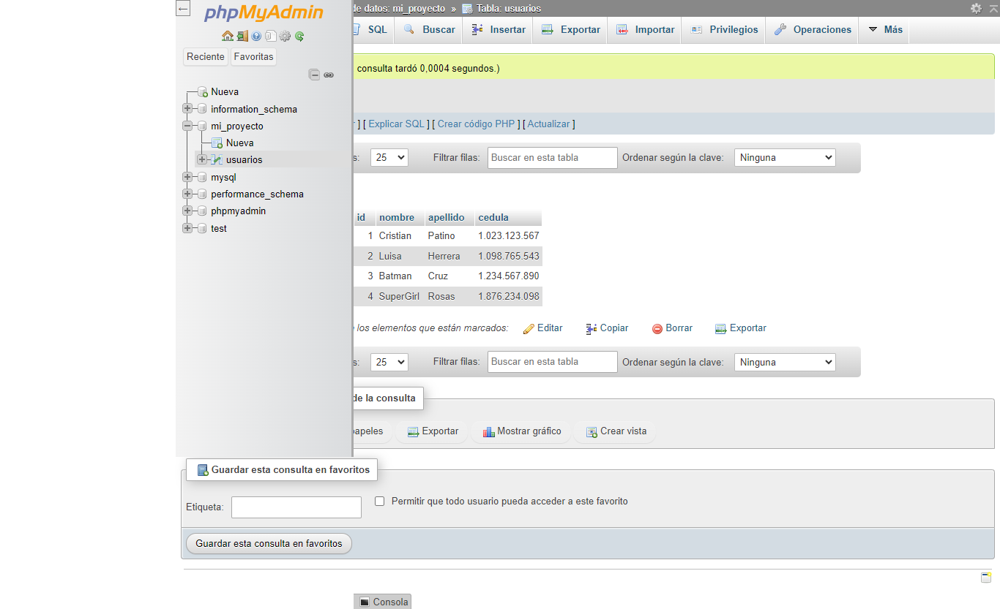

<h1>Taller 10 Luisa Fernanda Herrera Chávez </h1>

<h2> Información</h2>

Curso: full Stack Basico - Grupo 1 

Profesor: Cristian Patiño

<h2> Punto 1: </h2>

<h2> Punto 2: </h2>

<h2> Punto 3: </h2>

<h2> Punto 4: </h2>

<h2> Punto 5 - 6 - 7: </h2>
<h3>5- Base de datos</h3>

